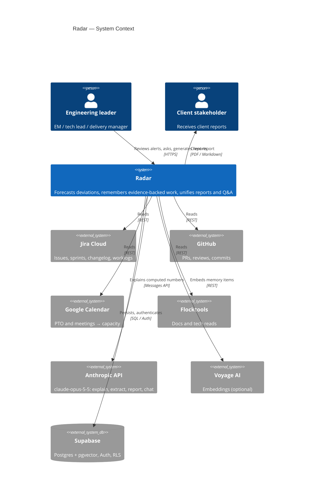
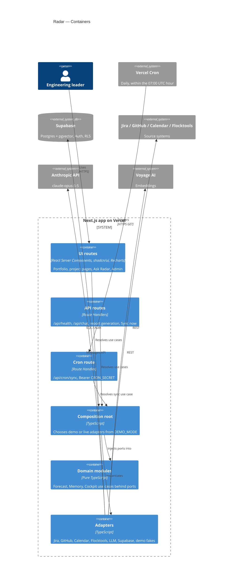
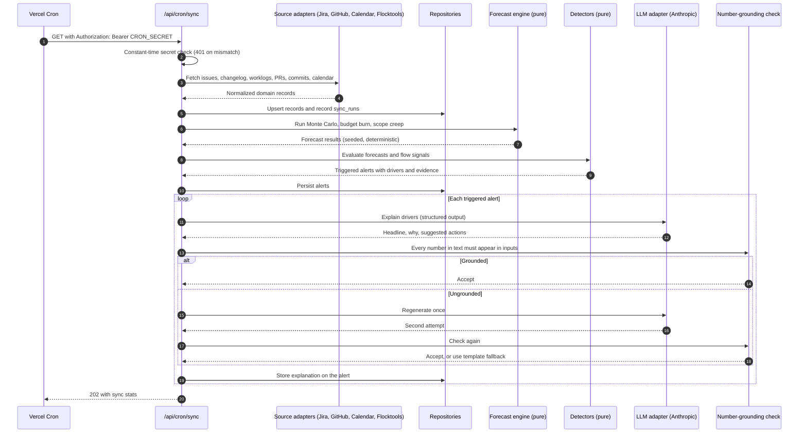
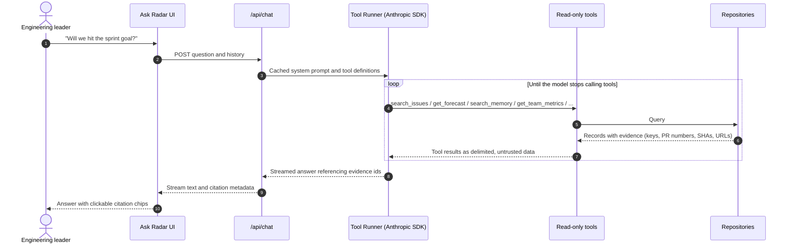

# Architecture

Radar is one Next.js app on Vercel, organized as a hexagon: pure domain modules in the middle, ports around them, and adapters (Jira, GitHub, Calendar, Flocktools, Anthropic, Supabase, demo fakes) on the outside. Deterministic math produces every number; the LLM only explains numbers it is given.

## Quick path

| If you want to... | Read |
|-------------------|------|
| See who uses Radar and what it talks to | [System context](#system-context) |
| Find where code runs | [Containers](#containers) |
| Follow a nightly sync end to end | [Sync, forecast, and alert](#sync-forecast-and-alert) |
| Follow a chat question end to end | [Ask Radar](#ask-radar) |
| Know where new code goes | [Folder structure](#folder-structure) and [Layering rules](#layering-rules) |

## System context



## Containers



In demo mode the adapters box resolves to in-memory fakes, so no arrow leaves the app.

## Sync, forecast, and alert

The nightly path. Every number is computed before the LLM is involved, and the LLM output is checked against those numbers.



## Ask Radar

A question becomes read-only tool calls over the same repositories the cockpit uses, and the answer streams back with citations.



## Folder structure

Screaming structure: top-level folders name business capabilities, not technical layers. Every module, including each cockpit submodule, has the same three layers.

```
src/
  app/                       Next.js routes (thin: resolve use cases, render)
    api/health/              Liveness probe
    api/cron/sync/           Vercel Cron entry point
  composition-root.ts        The only place that picks demo or live adapters
  modules/
    forecast/{domain,application,ui}/
    memory/{domain,application,ui}/
    cockpit/
      reports/{domain,application,ui}/
      metrics/{domain,application,ui}/
      chat/{domain,application,ui}/
  shared/
    domain/                  Evidence, Alert, Project, Sprint, Issue, ...
    ports/                   Clock, IssueTracker, CodeHost, LLM, repositories, ...
    config/                  Validated, server-only env
  adapters/
    jira/ github/ calendar/ flocktools/ llm/ supabase/ demo/
  components/                App shell and shadcn/ui primitives
  lib/                       Framework-level helpers (http auth, cn)
supabase/migrations/         SQL migrations
scripts/                     Operational scripts (seed)
test/                        Test helpers and stubs (not shipped)
```

## Layering rules

| Layer | Lives in | Must not import |
|-------|----------|-----------------|
| Domain | `src/modules/**/domain`, `src/shared/domain` | Adapters, composition root, `next`, `react`, `react-dom`, `@anthropic-ai/*`, `@supabase/*` |
| Application (use cases) | `src/modules/**/application` | Adapters, composition root, `next`, `@anthropic-ai/*`, `@supabase/*` |
| Ports | `src/shared/ports` | Adapters, composition root, `next`, `@anthropic-ai/*`, `@supabase/*` |
| Adapters | `src/adapters/**` | Routes (`src/app`), components, any `ui` layer, composition root |
| Composition root | `src/composition-root.ts` | No restrictions |
| Everything else | `src/app`, `src/modules/**/ui`, `src/components`, `src/lib`, `src/shared/config`, other `src/*` files | Adapters |

- **Only the composition root picks adapters.** `DEMO_MODE` decides demo or live wiring there and nowhere else.
- **The container carries no secrets.** It exposes the mode, model id, public app URL, and ports. API keys are consumed inside the composition root when adapters are built; the cron secret is read through `verifyCronSecret()`.
- **ESLint enforces the table.** `no-restricted-imports` blocks in `eslint.config.mjs` fail the lint step on a violation. "Adapters" covers `@/adapters`, `./adapters`, and `../adapters` paths; third-party paths that happen to contain `adapters` are allowed.
- **Time is a port.** Code that needs "now" takes a `Clock`, so the demo seed and forecasts are reproducible.

## Math computes, the LLM explains

- Forecasts (sprint completion probability, budget exhaustion date, scope creep) are pure functions with seeded randomness and unit tests.
- The LLM receives computed numbers and drivers and writes the headline, the why, and suggested actions. It never predicts.
- Any number in LLM text that is not in the inputs triggers one regeneration, then a deterministic template.
- Every claim carries `evidence[]`; claims without evidence are dropped server-side.

See [decisions.md](./decisions.md) for the reasoning behind these rules.
