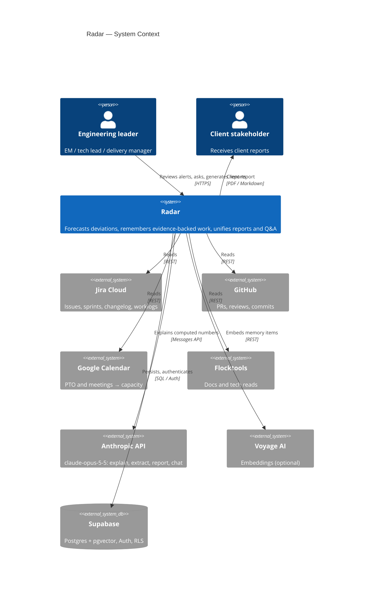
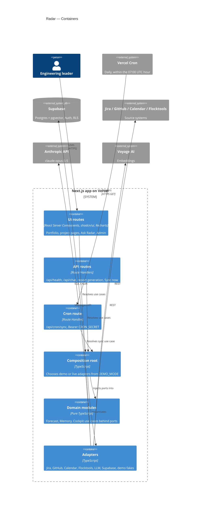
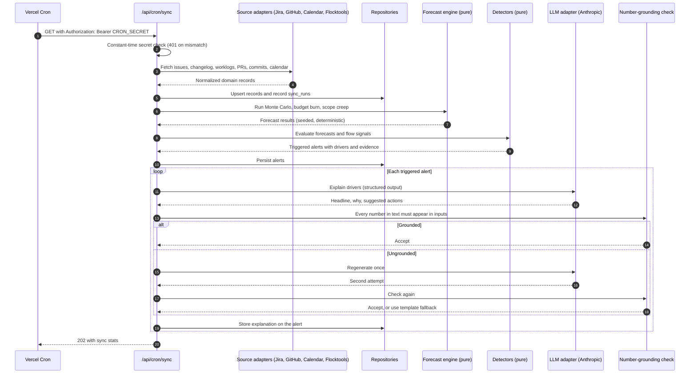
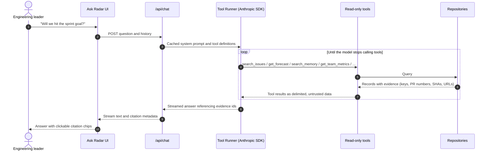
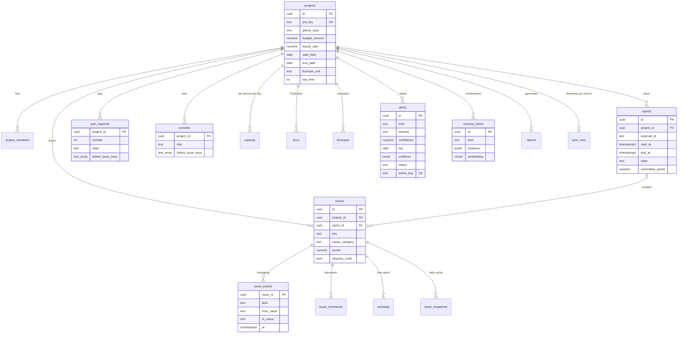

# Architecture

Radar is one Next.js app on Vercel, organized as a hexagon: pure domain modules in the middle, ports around them, and adapters (Jira, GitHub, Calendar, Flocktools, Anthropic, Supabase, demo fakes) on the outside. Deterministic math produces every number; the LLM only explains numbers it is given.

## Quick path

| If you want to... | Read |
|-------------------|------|
| See who uses Radar and what it talks to | [System context](#system-context) |
| Find where code runs | [Containers](#containers) |
| Follow a nightly sync end to end | [Sync, forecast, and alert](#sync-forecast-and-alert) |
| See how forecasts and alerts are computed | [Forecast engine](#forecast-engine) |
| Follow a chat question end to end | [Ask Radar](#ask-radar) |
| See the tables and how they relate | [Data model](#data-model) |
| Know where new code goes | [Folder structure](#folder-structure) and [Layering rules](#layering-rules) |

## System context



## Containers



In demo mode the adapters box resolves to in-memory fakes, so no arrow leaves the app. On first access each UTC day the composition root builds the scenario for that day and runs it through the same sync use case the cron uses, into an in-memory repository ([D-019](./decisions.md#d-019--demo-boots-through-the-real-sync-pipeline), [D-033](./decisions.md#d-033--the-demo-container-is-rebuilt-per-utc-day)). In live mode (phase 9), user requests read through a request-scoped repository so RLS applies; the service-role repository serves only cron, sync, and admin jobs ([D-030](./decisions.md#d-030--live-reads-use-a-request-scoped-rls-repository)).

## Sync, forecast, and alert

The nightly path. Every number is computed before the LLM is involved, and the LLM output is checked against those numbers.



## Forecast engine

`src/modules/forecast` turns synced data into forecasts and alerts. The math is pure and seeded; the use case only does IO through ports.

| Piece | Where | What it does |
|-------|-------|--------------|
| `evaluateProject` | `domain/engine.ts` | Runs every detector on a `ProjectSnapshot` (all records plus an injected `now`) |
| Sprint completion | `domain/sprint-completion.ts`, `monte-carlo.ts`, `throughput.ts`, `sprint-scope.ts` | Bootstrap Monte Carlo (10,000 runs, seed `projectId:day`) with capacity scaling; P, expected/P50/P85 dates, burn-up with cone ([D-037](./decisions.md#d-037--sprint-forecast-bootstraps-daily-throughput), [D-038](./decisions.md#d-038--capacity-scales-by-the-elapsed-day-baseline)) |
| Budget runway | `domain/budget.ts` | EWMA daily burn, exhaustion date, % over at the end date, spend series ([D-039](./decisions.md#d-039--budget-burn-is-an-ewma-with-alpha-03)) |
| Scope creep | `domain/scope-creep.ts` | Net scope added since the sprint start vs. commitment ([D-040](./decisions.md#d-040--scope-creep-is-net-growth-over-15-percent)) |
| Flow signals | `domain/flow.ts` | WIP over limit, stale reviews, stalled issues, reopen rate ([D-041](./decisions.md#d-041--flow-signal-thresholds-and-severity-mapping)) |
| `runForecasts` | `application/run-forecasts.ts` | Loads snapshots, stores `sprint_completion` / `budget_runway` forecasts, upserts triggered alerts, and auto-resolves cleared ones ([D-042](./decisions.md#d-042--alerts-auto-resolve-when-a-conclusive-detector-stops-firing)) |

Every detector returns a `DetectorResult`: drivers carry the exact numbers the LLM may cite, and evidence points at the issues, PRs, commits, worklog tabs, and sprint reports behind them. The demo calibration (`src/adapters/demo/forecast-pipeline.test.ts`) asserts the scripted story on every weekday anchor.

## Ask Radar

A question becomes read-only tool calls over the same repositories the cockpit uses, and the answer streams back with citations.



## Data model

Postgres on Supabase (`supabase/migrations`). Every table synced from a source has a natural-key unique constraint (`issues (project_id, key)`, `pull_requests (project_id, number)`, `commits (project_id, sha)`, ...), so syncs are idempotent upserts. RLS is on for every table: members read their projects' rows, owners and leads make the two user writes, the service role does everything else, and anon gets nothing ([D-025](./decisions.md#d-025--sync-runs-are-per-project-with-sanitized-errors), [D-026](./decisions.md#d-026--llm-usage-is-admin-only), [D-028](./decisions.md#d-028--owners-and-leads-write-viewers-read)).



Not drawn: `llm_calls` (usage and cost, admin-only) has no project. `sync_runs` holds one row per project and source per sync, with a sanitized error reason. PRs and commits link to issues through `linked_issue_keys` (uppercase keys parsed from titles, branches, and messages), not foreign keys, because they can reference issues that were never synced.

Modeling choices worth knowing:

- **Rows stay inside their project.** Children reference parents with composite foreign keys (`(project_id, issue_id) -> issues (project_id, id)`), so RLS on `project_id` can never expose another project's record ([D-027](./decisions.md#d-027--composite-foreign-keys-keep-rows-inside-their-project)).
- **Evidence is JSON on the claim.** Alerts and memory items store `evidence jsonb` (at least one pointer, enforced by a check constraint), not a join table: evidence is immutable and always read with its claim.
- **Burn-up comes from events.** Scope and progress over time are rebuilt from `issues` + `issue_events`; `issue_snapshots` is only a live-mode cache ([D-018](./decisions.md#d-018--burn-up-is-derived-from-issues-and-events)).
- **One active alert per kind.** A generated `active_key` (`project_id:kind` while open or acknowledged) has a plain unique index that supabase-js can target with `onConflict`; resolved alerts drop out of it, so a re-detection opens a new alert ([D-029](./decisions.md#d-029--alerts-upsert-on-a-generated-active-key)).
- **Semantic search.** `memory_items.embedding extensions.vector(1024)` with an HNSW cosine index; `match_memory_items(project_id, embedding, k)` runs as the caller, so RLS still applies, and follows the same rules as the in-memory repository (k <= 0 returns nothing, at most 50 rows, zero vectors never match).

## Folder structure

Screaming structure: top-level folders name business capabilities, not technical layers. Every module, including each cockpit submodule, has the same three layers.

```
src/
  app/                       Next.js routes (thin: resolve use cases, render)
    api/health/              Liveness probe
    api/cron/sync/           Vercel Cron entry point
  composition-root.ts        The only place that picks demo or live adapters
  modules/
    ingestion/application/   syncProjects: sources -> repository, sync runs
    forecast/{domain,application,ui}/
    memory/{domain,application,ui}/
    cockpit/
      reports/{domain,application,ui}/
      metrics/{domain,application,ui}/
      chat/{domain,application,ui}/
  shared/
    domain/                  Evidence, Alert, Project, Sprint, Issue, ... (Zod schemas + pure helpers)
    ports/                   Clock, RadarRepository, IssueTracker, CodeHost, CalendarSource, DocsSource
    config/                  Validated, server-only env
  adapters/
    demo/                    Scenario builder, demo sources, in-memory repository
    supabase/                Migration tests today; repository in phase 9
    unavailable/             Live-mode placeholders until phase 9
    shared/                  Helpers for adapters (stable UUIDs and SHAs)
    jira/ github/ calendar/ flocktools/ llm/
  components/                App shell and shadcn/ui primitives
  lib/                       Framework-level helpers (http auth, cn)
supabase/migrations/         SQL migrations (validated on PGlite in tests)
scripts/                     Operational scripts (seed)
test/                        Test helpers and stubs (not shipped)
```

## Layering rules

| Layer | Lives in | Must not import |
|-------|----------|-----------------|
| Domain | `src/modules/**/domain`, `src/shared/domain` | Adapters, composition root, `next`, `react`, `react-dom`, `@anthropic-ai/*`, `@supabase/*` |
| Application (use cases) | `src/modules/**/application` | Adapters, composition root, `next`, `@anthropic-ai/*`, `@supabase/*` |
| Ports | `src/shared/ports` | Adapters, composition root, `next`, `@anthropic-ai/*`, `@supabase/*` |
| Adapters | `src/adapters/**` | Routes (`src/app`), components, any `ui` layer, composition root |
| Composition root | `src/composition-root.ts` | No restrictions |
| Everything else | `src/app`, `src/modules/**/ui`, `src/components`, `src/lib`, `src/shared/config`, other `src/*` files | Adapters |

- **Only the composition root picks adapters.** `DEMO_MODE` decides demo or live wiring there and nowhere else.
- **The container carries no secrets.** It exposes the mode, model id, public app URL, and ports. API keys are consumed inside the composition root when adapters are built; the cron secret is read through `verifyCronSecret()`.
- **ESLint enforces the table.** `no-restricted-imports` blocks in `eslint.config.mjs` fail the lint step on a violation. "Adapters" covers `@/adapters`, `./adapters`, and `../adapters` paths; third-party paths that happen to contain `adapters` are allowed.
- **Time is a port.** Code that needs "now" takes a `Clock`, so the demo seed and forecasts are reproducible.

## Math computes, the LLM explains

- Forecasts (sprint completion probability, budget exhaustion date, scope creep) are pure functions with seeded randomness and unit tests.
- The LLM receives computed numbers and drivers and writes the headline, the why, and suggested actions. It never predicts.
- Any number in LLM text that is not in the inputs triggers one regeneration, then a deterministic template.
- Every claim carries `evidence[]`; claims without evidence are dropped server-side.

See [decisions.md](./decisions.md) for the reasoning behind these rules.
